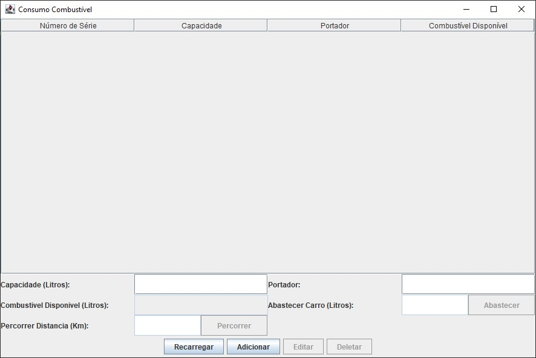
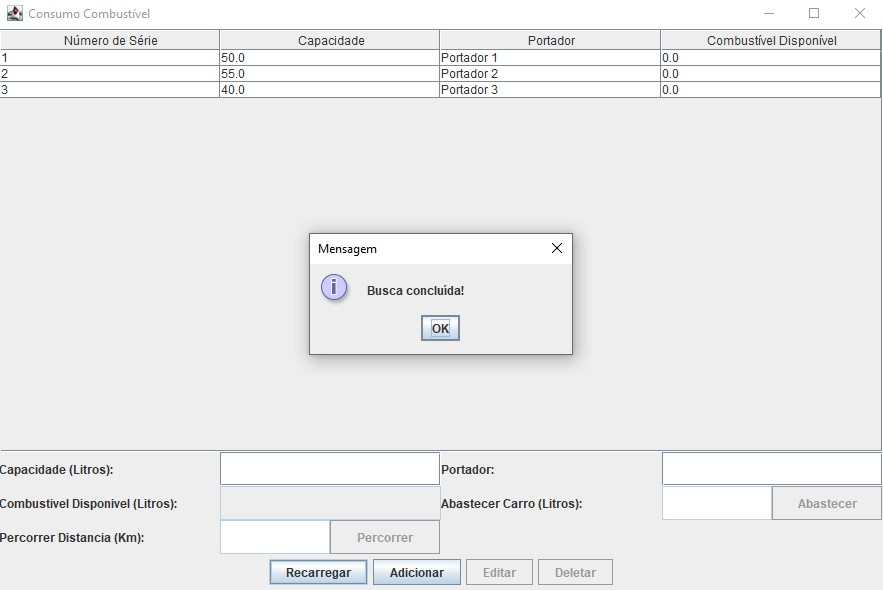
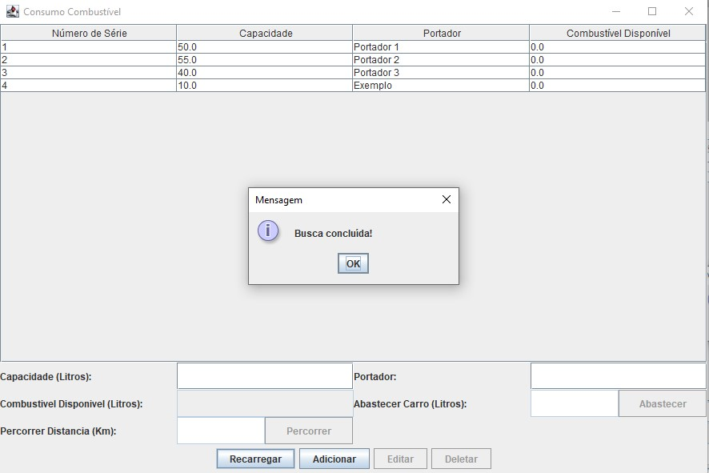
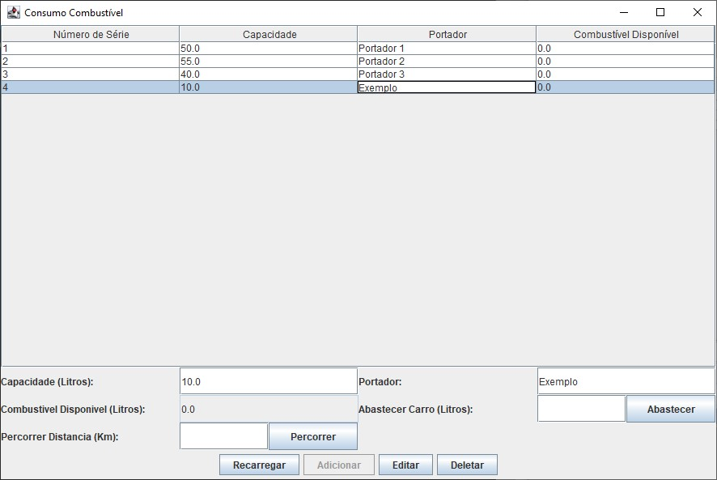
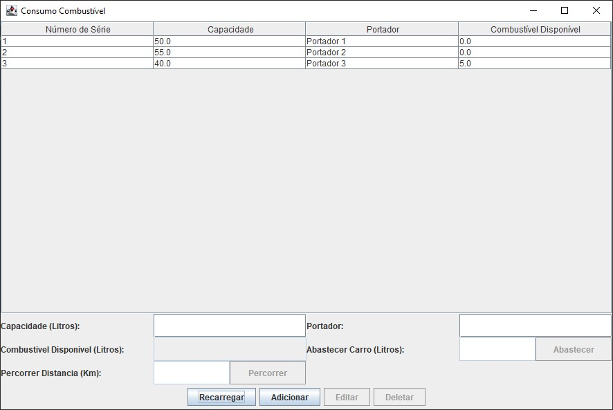

# Teste Prático - Infortech

Teste prático da Infortech utilizando Java e MySQL.

## Implemente

Crie uma classe chamada Consumo Combustível com, no mínimo, três atributos:

- [x] Número de série: número sequencial definido automaticamente quando um carro é fabricado;
- [x] Capacidade: indica o número máximo de litros que o tanque suporta;
- [x] Portador: o responsável pelo carro;

E três métodos:

- [x] Abastecer: que recebe o número de litros que serão inseridos no carro;
- [x] Rodar: que informa a quantidade de litros utilizado se houver combustível disponível (porém, trava a partida se for chamado sem combustível);
- [x] Contar: que conta o número de litros disponíveis no carro;

Em seguida, crie uma classe chamada Principal que:

- [x] Crie três carros de portadores quaisquer diferentes (um com capacidade para 50 litros, outro para 55 e o último para 40);
- [x] Carregue todas com quantidades informadas pelo usuário e dispare continuamente todas;

Crie uma camada de persistência com:
- [x] Incluir, alterar e Excluir para a classe Consumo Combustível para que os dados possam ser atualizados.

### Observações

- O consumo médio dos carros é de 1 litro a cada 2km já que não foi especificado.

- Não compreendi o que era esperado do trecho: "... e dispare continuamente todas;", portanto instânciei os três carros quando o programa inicializa e deixei com que o usuário decida abastecer ou percorrer alguma distância.

## Tencnologias utilizadas

- Java (JavaSE-17)
- Xampp (8.2.4) para Windows
- MySQL Workbench (8.0 CE) para Windows

## Como usar

Esta é a interface do programa ao abrir:

Para atualizar a tabela utilize o botão recarregar:

Para adicionar um carro, utilize os campos de texto: "capacidade" e "portador", junto com o botão "Adicionar".

Para editar um carro, selecione ele na tabela com um clique. As informações serão levadas para os campos para que possa editar. Edite-as e use o botão "Editar" para salvar as mudanças.

Para abastecer um carro, refaça o passo anterior, mas ao invés de usar o botão "Editar", preencha o campo "Abastecer Carro (Litros)" e utilize o botão "Abastecer".

> Observação: para cancelar a seleção de um item da lista, utilize o botão "Recarregar".

Para percorrer uma distância com um carro, refaça o passo anterior mas ao invés de usar o botão "Abastecer", preencha o campo "Percorrer Distância (Km)" e utilize o botão "Percorrer".

